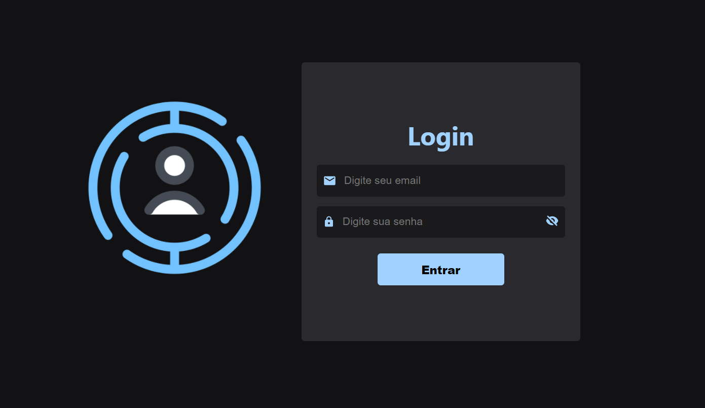

# Página de Login



### 🛠 Tecnologias

As seguintes ferramentas foram usadas na construção do projeto:

- [Node.js](https://nodejs.org/en/)
- [React](https://pt-br.reactjs.org/)
- [JWT](https://jwt.io/)
- [MySQL](https://www.mysql.com/)


### 🏁 Instalação
```bash
# Clone este repositório
$ git clone <https://github.com/iasmim21/login.git>

# Acesse a pasta do projeto no terminal/cmd
$ cd login
```
### 1. Rodando o Backend (servidor)

```bash
# Vá para a pasta api
$ cd api

# Instale as dependências
$ npm install ou yarn install

# O arquivo .env.example contém todas as variáveis ​​de ambiente necessárias para executar o projeto
# Crie um arquivo .env e copie o formato do arquivo .env.example

# Execute a aplicação
$ npm dev ou yarn dev

# O servidor inciará na porta:8080

# Cadastre um usuário na tabela users para conseguir realizar o login
```

### 1. Rodando o Frontend (cliente)

```bash
# Vá para a pasta my-app
$ cd my-app

# Instale as dependências
$ npm install ou yarn install

# Execute a aplicação
$ npm start ou yarn start
```


### 🚀License
Este projeto está licenciado nos termos da licença [MIT](https://choosealicense.com/licenses/mit/).

### Autor

Iasmim Bitencourt


[](mailto:tgmarinho@gmail.com)

👋🏽 Entre em contato!
